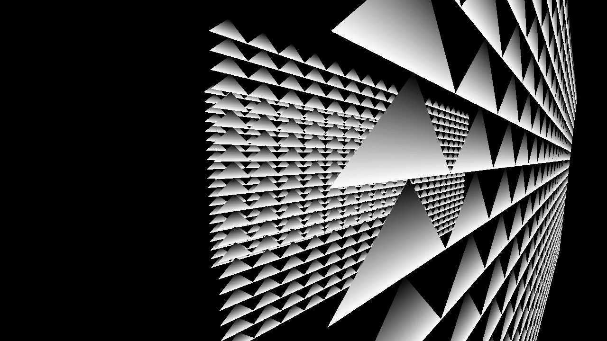

# Console Graphics

__Project creation date:__ 09.05.2020

## Description
This project can render points, lines and triangles with a custom written 3D rendering engine using the CPU.

## Technologies
* C++

## Remarks
The original version was rendered on the Console with ASCII symbols.

## Pictures

